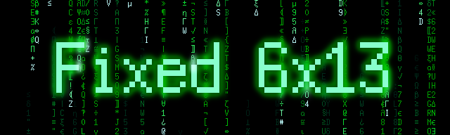

  <!-- FIXME these are not correctly selected or don't even display
  <picture>
    <source srcset="title.webp" type="image/webp">
    <source srcset="title.gif" type="image/gif">
    
  </picture>
  -->
  

Another format conversion of a specific size misc-fixed font, with the goal of
pixel perfect rendering at the target size, as well as a few additions and
changes of my own.

Installing
----------

* For Mac OS
    - Install `Fixed6x13/Fixed6x13*.ttf` using the system FontBook application

  To achieve pixel perfect rendering, you will also need to (at least):
    - Disable the non-integer display scaling which is *applied by default*:
        + System Preferences → Displays → Resolution = **Scaled**
        + Select the scaling where the actual display resolution (from About
          This Mac → Displays) is an *integer multiple* of what the scaling
          claims to "look like".  Eg, for me that's half.

      Note that this will "zoom" your entire screen!  If that makes no sense,
      then you're probably in the wrong place – "This isn't the font you're
      looking for" – [click here to continue][safeplace]
    - Disable "font smoothing"

            defaults -currentHost write -g AppleFontSmoothing -int 0

* Other systems – no idea!  Probably it should work, but let us know about any
  shenanigans you had to pull to achieve pixel perfection for your favorite
  platform.

[safeplace]: https://fonts.google.com/?classification=Monospace

Notes
-----

* The Unicode extension of the original BDF font was obtained from [\[1\]][1].
  A copy of the files for our target size is included here for completeness.
* The generated font is *not hinted*, so requires rendering at specific sizes
  to be pixel perfect.
* Looks best at (integer multiples of) 13 *display* pixels, but also works
  fine above ~24px.  Becomes blurry at smaller sizes or near but not 13px.
* You can check the rendering by opening `Fixed6x13/*chars.txt`, which lists
  all of the characters supported by the font, and comparing that to the
  corresponding PNG.  Probably by screenshot and zoom in, also ImageMagick can
  compare images.
* Some characters have been [added and changed][2]; the tooling is included so
  you can always regenerate from the original, if preferred:

            python -m bdf2ttf misc-fixed/6x13.bdf

[1]: https://www.cl.cam.ac.uk/~mgk25/ucs-fonts.html
[2]: mod6x13.py

The Backstory
-------------

Some time ago, due to a series of unfortunate life choices which we shall
refer to only as "The Mojave Incident", I found myself mid-development and
completely screwed (yeah, but *dark mode*!).  Overnight:

The latest build of the application now showed only a blank window.

My antiquated development environment was completely non-functional.

I couldn't even open an editor!

Well, after the disbelief ("Maybe something just didn't install correctly?"),
the cursing ("How could they *deprecate* the *whole thing* on me‽"), the
management intervention ("Can I just restore from backup…?") and the salty
tears of aged procrastination ("This is my own damn fault…"), I eventually
decided to drag my sorry ass into more modern times and set about to sort each
of these issues, starting with the simple things that we sometimes take for
granted, like the ability to *edit text files*.

I eventually settled on an editor and I got used to a lot of new things ("Oh,
OK, we do it *that* way now").  But, even as this new age started to coalesce,
something always "felt off" to me, the code just didn't *look* right.

It was like that bitter undertone ruining a great smelling cup of coffee, or
the intermittent movement in your periphery that keeps drawing your eye, or an
annoying sound that you can't seem to tune out.  The immersion was broken, I
couldn't stay in the zone; even in the midst of hacking away I would get
distracted from the content by the presentation.

Of course, the font I had been using to edit code (for years) was deprecated
along with everything else.  I explored alternatives, but could never find a
workable replacement.  When you're working with code, there is a delicate
balance in the density of information: too sparse doesn't present enough
context – like playing an FPS with a tiny FoV, or walking around with
binoculars strapped to your face – and too dense becomes illegible or can even
cause eye strain, *depending on the font*.

There are several aspects of a font that affect the legibility / density
tradeoff.  The size is an obvious one, but also the width or aspect ratio, the
weight or thickness of the strokes and definitely the sharpness at smaller
sizes.

This is a very personal preference that's different for everyone; we all have
different environments, eyesight and taste.  For myself, I need a
semicondensed font (with relatively tall, narrow letters) to optimize the
horizontal real estate on my laptop screen.  It needs to be small enough that
most fonts start to get blurry and for many the strokes get too thin.  If only
some artist would craft a pixel perfect font to these specifications…  but
wait, they already did, it's just in the wrong format!

This is not the worlds first attempt to do just this, with these exact fonts,
and there are plenty of tools out there to vectorize your old bitmap fonts.  I
did explore some of those paths, but none of them were able to meet my …
quality bar.  The first pass of this project took a weekend of hacking and
I've used the result for years – totally worth it.  Recently, I found the need
to add a few more characters, so I resurrected this hacky mess and took some
time for clean up and to more extensively validate the result for release.

So, I would like to think that this is not purely nostalgic, that I'm not
simply inflexible, that there is a modern font out there I could be happy
with; but, now I have comfortable old misc-fixed 6x13 semicondensed and none
of that matters anymore.

— Enjoy!

License
-------

The original misc-fixed BDF fonts were placed in the public domain.

> Public domain font.  Share and enjoy.

Out of respect and gratitude to the upstream authors, this rest of this
project is similarly [marked with CC0][CC0] – "No Rights Reserved".

[][CC0]

[CC0]: https://creativecommons.org/publicdomain/zero/1.0/
